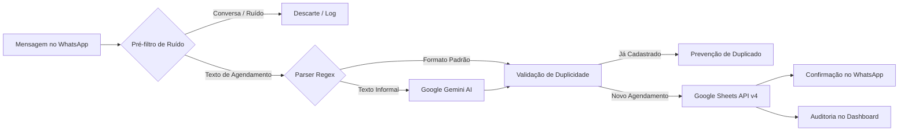

# 🚛 WhatsApp Guincho Bot — Grupo Hazul

<p align="center">
  <strong>Automação Inteligente de Agendamentos e Gestão Logística de Guinchos</strong><br>
  Integrado com <strong>WhatsApp Web</strong>, <strong>Google Sheets API v4</strong>, <strong>Google Gemini AI</strong> e <strong>Painel de Controle Corporativo</strong>.
</p>

<p align="center">
  
  
  
  
  
  
  
</p>

---

## 📑 Sumário

- [Visão Geral](#-visão-geral)
- [Painel de Controle Web (Dashboard)](#-painel-de-controle-web-dashboard)
- [Fluxo Operacional](#-fluxo-operacional)
- [Inteligência Artificial & Classificação](#-inteligência-artificial--classificação)
- [Regras de Negócio e Concessionárias](#-regras-de-negócio-e-concessionárias)
- [Estrutura da Planilha Google Sheets](#-estrutura-da-planilha-google-sheets)
- [Rotina Diária Automática (07:00 às 19:00)](#-rotina-diária-automática-0700-às-1900)
- [Estrutura do Projeto](#-estrutura-do-projeto)
- [Instalação e Configuração](#-instalação-e-configuração)
- [Execução e Atalhos do Sistema](#-execução-e-atalhos-do-sistema)
- [Testes Automatizados](#-testes-automatizados)
- [Segurança de Dados](#-segurança-de-dados)

---

## 📌 Visão Geral

O **WhatsApp Guincho Bot** atua como operador autônomo conectado aos grupos operacionais de logística e remoção de veículos do **Grupo Hazul**. Ele monitora solicitações de transporte enviadas pelas concessionárias, interpreta mensagens estruturadas ou informais com Inteligência Artificial, evita duplicidades, preenche automaticamente a planilha oficial de faturamento no Google Sheets e responde no grupo confirmando o agendamento.



---

## 🎛️ Painel de Controle Web (Dashboard)

O sistema conta com um **Dashboard Corporativo completo** acessível via navegador em `http://localhost:3000`, desenvolvido com padrões de design modernos (*shadcn/ui*, *Linear* e *Vercel*):

- **Barra Superior Corporativa**: Logotipo oficial do Grupo Hazul, indicador de status de conexão com telemetria de latência (`ping ms`) e alternador nativo de tema **Light / Dark Mode** com persistência local.
- **📊 Aba 1: Visão Geral**:
  - Telemetria de consumo de memória RAM do Node.js (RSS e Heap), Uptime formatado, contagem de mensagens processadas, agendamentos válidos e ciclo ativo.
  - Tabela de auditoria em tempo real com filtros por status (*Todos*, *Agendamentos*, *Duplicados*, *Descartados*), pesquisa instantânea e modal de detalhes com os dados extraídos e a mensagem original.
- **⚙️ Aba 2: Comandos**:
  - Botões para Iniciar e Parar o processo do bot com notificações de feedback instantâneas.
  - Releitura sob demanda (*Re-scan*) por ciclo de faturamento ou por data personalizada selecionada em calendário.
  - Teste de conexão e sincronização com Google Sheets.
  - Limpeza de logs do terminal.
- **💻 Aba 3: Logs / Terminal**:
  - Console em tempo real com window dots e tema de alto contraste.
  - Color-coding sintático (`[INFO]`, `[WARN]`, `[ERRO]`, `[OK]`).
  - Filtros rápidos de severidade, busca textual interna, botão para copiar logs com 1 clique e chave de *Auto-scroll*.
- **🔧 Aba 4: Configurações**:
  - Exibição de variáveis de ambiente, status das credenciais (WhatsApp, Sheets, Gemini) com mascaramento seguro, horários de expediente e ambiente de execução.

---

## 📋 Fluxo Operacional

1. **Conexão e Sessão Persistente**:
   - Conecta ao WhatsApp Web via `whatsapp-web.js` com Chromium headless.
   - Utiliza autenticação persistente (`LocalAuth` em `.wwebjs_auth/`), dispensando QR Code após o primeiro pareamento.

2. **Cálculo Dinâmico do Ciclo de Faturamento**:
   - As concessionárias operam no ciclo contábil do **dia 24 do mês anterior até o dia 23 do mês atual**:
     - Viagens de **24/08 a 23/09** $\rightarrow$ Aba **`SETEMBRO 2026`**
     - Viagens de **24/09 a 23/10** $\rightarrow$ Aba **`OUTUBRO 2026`**
     - Viagens de **24/10 a 23/11** $\rightarrow$ Aba **`NOVEMBRO 2026`**
   - O bot cria ou seleciona automaticamente a aba correta daquele período.

3. **Varredura e Releitura de Histórico**:
   - Ao iniciar (ou via botão de releitura no Painel), o bot percorre as mensagens do grupo desde o início do ciclo vigente.
   - Compara cada agendamento com as linhas já cadastradas e insere apenas os pendentes, garantindo zero duplicidades.

4. **Gravação Formatada no Google Sheets**:
   - Preenche exclusivamente as colunas operacionais (**A até H**).
   - Preserva intactas as fórmulas financeiras (Coluna K `=I{row}/J{row}`) e o status da Coluna L (`" NÃO FATURADO"`).
   - Aplica estilização corporativa: Coluna A em verde suave (`#99cc00`), alinhamento centralizado e bordas pretas padronizadas.

---

## 🤖 Inteligência Artificial & Classificação

O sistema utiliza a biblioteca oficial do Google **`@google/genai`**:

- **Modelo**: `gemini-1.5-flash` (ou `gemini-3.6-flash`)
- **Pré-Filtros de Ruído**: Mensagens como *"guincho à disposição"*, *"já carregou?"*, *"agendado 17/09"* ou saudações são filtradas de imediato, economizando chamadas de API e eliminando falsos positivos.
- **Extração Estruturada**: Saída garantida em formato JSON determinístico com campos estruturados:
  - `veiculo`, `cor`, `chassiPlaca`, `departamento`, `origem`, `destino`, `faturarPara`, `agendarPara`, `transporte`.

---

## 🏢 Regras de Negócio e Concessionárias

Quando o faturamento não estiver explicitado na mensagem, o bot aplica regras de roteamento geográfico e operacional para definir a concessionária responsável pela Nota Fiscal:

| Concessionária / Unidade | Palavras-Chave de Mapeamento |
| :--- | :--- |
| **KENTO MM** | Kento Mogi Mirim, Toyota Mogi Mirim |
| **KENTO SJBV** | Kento São João da Boa Vista, Toyota São João |
| **XIAN MM** | Xian Mogi Mirim, Caoa Chery Mogi Mirim |
| **XIAN SJBV** | Xian São João da Boa Vista, Caoa Chery São João |
| **HONDA MM** | Honda Mogi Mirim, Dueto Honda, Loja Honda Kodyve |
| **HYMAX MG** | Hymax Poços de Caldas, Hymax Pouso Alegre, Sul de Minas |
| **CODIVE CPS / HZ CAMPINAS** | Codive Campinas, Hazul Campinas |
| **HAZUL ITAPIRA** | Hazul Itapira |
| **50% HYMAX - 50% CODIVE** | Transferências mútuas entre Hymax e Codive |

---

## 📊 Estrutura da Planilha Google Sheets

Padrão oficial **"CONTROLE DE TRANSPORTE CEGONHA E PLATAFORMA"**:

| Coluna | Cabeçalho | Gerenciado Por | Descrição / Formato |
| :---: | :--- | :---: | :--- |
| **A** | `DATA` | **Bot** | Fundo verde (`#99cc00`), centralizado, `dd/MM/yyyy` |
| **B** | `DEPARTAMENTO` | **Bot** | `NOVOS`, `SEMI NOVOS`, `FUNILARIA`, `MECANICA` |
| **C** | `CARRO` | **Bot** | Modelo do veículo (ex.: `TIGGO 7 SPORT`) |
| **D** | `PLACAS/ CHASSIS` | **Bot** | Chassi ou placa do automóvel |
| **E** | `LOCAL DE COLETA` | **Bot** | Concessionária ou endereço de origem |
| **F** | `LOCAL DE ENTREGA` | **Bot** | Concessionária ou endereço de destino |
| **G** | `VEICULO TRANSPORTE`| **Bot** | `PLATAFORMA` ou `CEGONHA` |
| **H** | `NOTA FISCAL` | **Bot** | Concessionária faturada |
| **I** | `CUSTO DA VIAGEM` | *Operação* | Valor total da viagem (lançamento financeiro manual) |
| **J** | `VEICULOS POR VIAGEM` | *Operação* | Quantidade de veículos na mesma viagem |
| **K** | `CUSTO UNITARIO` | *Fórmula* | Fórmula `=I{row}/J{row}` mantida intacta pelo bot |
| **L** | `Faturado/Não Faturado` | *Status* | Valor fixo `" NÃO FATURADO"` em azul escuro e negrito |

---

## ⏰ Rotina Diária Automática (07:00 às 19:00)

O bot está integrado ao Agendador de Tarefas do Windows para operação 100% autônoma:

1. **Início Automático às 07:00**:
   - Acorda o computador (`WakeToRun`) e inicializa o processo silenciosamente em segundo plano.
   - Conecta ao WhatsApp e faz a leitura de novos agendamentos.
2. **Encerramento Seguro às 19:00 com Janela de 5 Minutos**:
   - O processo do bot é encerrado com segurança.
   - Uma **janela visual de alerta** aparece na tela com contagem regressiva de **5 minutos (300 segundos)** informando o desligamento.
   - Se o usuário estiver trabalhando no computador e clicar em **"Cancelar Desligamento"**, o computador continua ligado. Caso contrário, desliga automaticamente após os 5 minutos.

---

## 📁 Estrutura do Projeto

```text
whatsapp-guincho-bot/
├── .env.example                  # Modelo de variáveis de ambiente
├── .gitignore                    # Regras estritas de exclusão de chaves e sessões
├── package.json                  # Dependências e scripts npm
├── README.md                     # Documentação completa do repositório
│
├── iniciar-painel.bat             # Abre o Painel de Controle Web (http://localhost:3000)
├── iniciar-painel.vbs             # Inicializador silencioso do painel
├── iniciar-bot.bat               # Inicia o bot com janela de terminal visível
├── iniciar-segundo-plano.vbs     # Inicia o bot silenciosamente em background
├── parar-bot.bat                 # Finaliza com segurança os processos ativos
├── ver-status.bat                # Exibe o status operacional do bot e logs recentes
├── configurar-rotina-diaria.bat    # Registra as rotinas das 07:00 e 19:00 no Windows
├── testar-aviso-desligamento.bat # Testa a janela de contagem regressiva de 5 minutos
├── enviar-para-github.bat        # Script de sincronização automática com o GitHub
│
├── scripts/
│   ├── aviso-desligamento.ps1     # Interface gráfica WPF com timer regressivo de 5 minutos
│   ├── configurar-agendamento.ps1 # Configuração do Agendador de Tarefas do Windows
│   └── remover-agendamento.ps1    # Utilitário para desativar agendamento do Windows
│
├── test/
│   └── test-ai-classification.js # Suíte de 7 testes de classificação da IA e pré-filtros
│
└── src/
    ├── index.js                  # Entry point principal e ciclo de vida do bot
    ├── whatsapp.js               # Conexão WhatsApp Web, listeners e varredura histórica
    ├── parser.js                 # Parser Regex, filtros de ruído e mapeamento de unidades
    ├── gemini.js                 # Cliente oficial Google Gemini com fallback
    ├── sheets.js                 # Integração Google Sheets v4, cache e formatação
    ├── history.js                # Banco local de auditoria de mensagens lidas
    ├── logger.js                 # Registrador de logs formatados no terminal e arquivo
    ├── distance.js               # Utilitário de cálculo de distâncias entre unidades
    ├── start-bg.js               # Inicializador desacoplado de segundo plano
    ├── status.js                 # Verificador de processos ativos
    ├── stop.js                   # Procedimento seguro de finalização
    ├── find-group.js             # Busca interativa de IDs de grupos
    ├── list-groups.js            # Listagem de todos os grupos da conta
    └── dashboard/                # Painel de Controle Web
        ├── server.js             # Servidor HTTP nativo com API REST
        ├── start-dashboard.js    # Inicializador do painel com abertura no navegador
        ├── start-bg-dashboard.js # Inicializador do painel em segundo plano
        └── public/               # Interface visual (HTML, CSS corporativo e JS)
            ├── index.html        # Estrutura modular em 4 abas
            ├── style.css         # Design system minimalista com Dark/Light Mode
            ├── app.js            # Lógica reativa, polling e manipulação do DOM
            └── assets/
                └── logo.png      # Logotipo oficial do Grupo Hazul
```

---

## 🚀 Instalação e Configuração

### Pré-requisitos
- [Node.js](https://nodejs.org/) versão 18 ou superior instalado.
- Conta Google Cloud com a **Google Sheets API** ativada e Service Account com arquivo de credencial JSON.
- Chave de API gratuita do [Google AI Studio](https://aistudio.google.com/).

### 1. Clonar o Repositório
```bash
git clone https://github.com/DiogoCavenaghi123/whatsapp-guincho-bot.git
cd whatsapp-guincho-bot
```

### 2. Instalar Dependências
```bash
npm install
```

### 3. Configurar Variáveis de Ambiente
Copie o modelo de ambiente e insira suas credenciais:
```bash
copy .env.example .env
```
Campos no `.env`:
```env
WHATSAPP_GROUP_ID=120363038885543019@g.us
GOOGLE_SHEET_ID=1abc...XYZ
GOOGLE_SHEET_TAB=Agendamentos
GOOGLE_CREDENTIALS_PATH=./credentials.json
GEMINI_API_KEY=AIzaSy...
GEMINI_MODEL=gemini-1.5-flash
DASHBOARD_PORT=3000
```

### 4. Compartilhar a Planilha
Abra a sua planilha no Google Sheets, clique em **Compartilhar** e adicione o e-mail da sua Service Account (encontrado em `credentials.json`, campo `client_email`) com a permissão de **Editor**.

---

## 🖥️ Execução e Atalhos do Sistema

O sistema pode ser operado via comandos npm ou pelos atalhos na pasta da Área de Trabalho **`BOT DO WHATSAPP`**:

| Ação | Atalho no Windows | Comando npm | Descrição |
| :--- | :--- | :--- | :--- |
| **Painel de Controle** | `Painel do Bot.lnk` | `npm run dashboard` | Abre a interface web em `http://localhost:3000` |
| **Iniciar (Segundo Plano)** | `Iniciar Bot (Segundo Plano).lnk` | `npm run start:bg` | Roda silenciosamente sem ocupar janela |
| **Iniciar (Terminal Visível)**| `Iniciar Bot Guincho.lnk` | `npm start` | Abre janela com logs em tempo real |
| **Verificar Status** | `Ver Status do Bot.lnk` | `npm run status` | Informa se o bot está rodando e exibe logs |
| **Parar Bot** | `Parar Bot.lnk` | `npm run stop` | Finaliza com segurança os processos ativos |
| **Testar Suíte da IA** | — | `npm test` | Executa a bateria de 7 testes de classificação |
| **Atualizar GitHub** | `Enviar para o GitHub.lnk` | — | Sincroniza e envia alterações para o repositório |

---

## 🧪 Testes Automatizados

O repositório inclui uma suíte automatizada de validação da inteligência artificial e dos pré-filtros de mensagens:

```bash
npm test
```

A suíte testa 7 cenários operacionais reais:
1. Aviso de guincho à disposição (ruído operacional descartado com sucesso).
2. Confirmação operacional curta (descartada).
3. Confirmação de agendamento prévio (descartada).
4. Dúvida operacional sem veículo (descartada via Gemini).
5. Mensagem de cortesia/agradecimento (descartada via Gemini).
6. Agendamento legítimo formulário padrão (aprovado via Regex).
7. Agendamento legítimo texto corrido (aprovado via Gemini).

---

## 🔒 Segurança de Dados

O arquivo `.gitignore` protege estritamente as credenciais e dados operacionais da empresa:
- Variáveis de ambiente (`.env`).
- Credenciais da Service Account Google (`credentials*.json`, `*.pem`, `*.key`).
- Sessões autenticadas do WhatsApp (`.wwebjs_auth/`, `.wwebjs_cache/`).
- Logs locais e arquivos de controle de PID (`logs/`, `.bot.pid`, `.dashboard.pid`).
