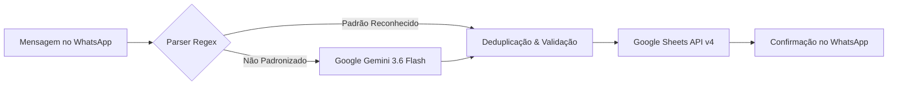

# 🚛 WhatsApp Guincho Bot

<p align="center">
  <strong>Automação Inteligente de Agendamentos e Gestão de Transportes de Veículos</strong><br>
  Integrado com <strong>WhatsApp Web</strong>, <strong>Google Sheets API v4</strong> e <strong>Google Gemini AI</strong>.
</p>

<p align="center">
  
  
  
  
  
</p>

---

## 📑 Sumário

- [Visão Geral](#-visão-geral)
- [O Que o Código Faz (Fluxo Operacional)](#-o-que-o-código-faz-fluxo-operacional)
- [Modelo de Linguagem Utilizado (LLM)](#-modelo-de-linguagem-utilizado-llm)
- [Regras de Negócio e Concessionárias](#-regras-de-negócio-e-concessionárias)
- [Estrutura da Planilha Google Sheets](#-estrutura-da-planilha-google-sheets)
- [Otimizações e Resiliência (Cotas da API)](#-otimizações-e-resiliência-cotas-da-api)
- [Estrutura de Diretórios](#-estrutura-de-diretórios)
- [Instalação e Configuração](#-instalação-e-configuração)
- [Execução e Atalhos (Segundo Plano)](#-execução-e-atalhos-segundo-plano)
- [Segurança de Dados](#-segurança-de-dados)

---

## 📌 Visão Geral

O **WhatsApp Guincho Bot** atua como operador autônomo conectado a grupos operacionais de logística e remoção de veículos. Ele monitora solicitações de transporte enviadas pelas concessionárias, interpreta mensagens estruturadas ou informais (com auxílio de Inteligência Artificial), evita duplicidades, formata e preenche automaticamente a planilha oficial de controle no Google Sheets, além de responder no grupo confirmando o agendamento.



---

## 📋 O Que o Código Faz (Fluxo Operacional)

1. **Conexão e Sessão Persistente**:
   - Conecta ao WhatsApp Web via `whatsapp-web.js` com Puppeteer/Chromium headless.
   - Utiliza autenticação persistente (`LocalAuth`), dispensando leitura de QR Code após a primeira conexão.

2. **Cálculo Automático do Ciclo de Faturamento**:
   - As concessionárias operam no ciclo financeiro do **dia 24 do mês anterior até o dia 23 do mês atual**.
   - Exemplos:
     - Viagens de **24/08 a 23/09** $\rightarrow$ Aba **`SETEMBRO 2026`**
     - Viagens de **24/09 a 23/10** $\rightarrow$ Aba **`OUTUBRO 2026`**
     - Viagens de **24/10 a 23/11** $\rightarrow$ Aba **`NOVEMBRO 2026`**
   - O bot localiza dinamicamente a aba correspondente na planilha.

3. **Varredura Ativa do Histórico ao Iniciar**:
   - Realiza uma rolagem ativa no chat do WhatsApp Web para recuperar todas as mensagens postadas desde o início do ciclo vigente.
   - Analisa cada agendamento histórico, compara com as linhas existentes da planilha e cadastra qualquer viagem pendente.
   - Respostas no grupo são desativadas durante a varredura inicial para evitar mensagens desnecessárias.

4. **Interpretação Híbrida de Mensagens**:
   - **Camada 1 (Parser Regex)**: Extrai dados imediatos em mensagens formatadas (`VEICULO`, `COR`, `CHASSI/PLACA`, `DE / COLETA`, `PARA / ENTREGA`, `DEPARTAMENTO`, `AGENDAR PARA`), tolerando ausência de pontuação ou formatações de negrito/itálico do WhatsApp.
   - **Camada 2 (Google Gemini AI)**: Acionado automaticamente caso o texto seja livre ou informal, retornando os campos estruturados em JSON.

5. **Gravação e Formatação Padronizada no Google Sheets**:
   - Preenche exclusivamente as colunas operacionais (**A até H**).
   - Preserva intactas as fórmulas financeiras (Coluna K `=I{row}/J{row}`) e o status da Coluna L (`" NÃO FATURADO"`).
   - Aplica formatação visual: Coluna A em verde suave (`#99cc00`), centralizado, com bordas pretas nas colunas operacionais.

6. **Notificação em Tempo Real**:
   - Para novas mensagens recebidas no grupo, envia confirmação formal contendo modelo, chassi/placa, origem, destino e faturamento.

---

## 🤖 Modelo de Linguagem Utilizado (LLM)

O sistema utiliza a biblioteca oficial do Google: **`@google/genai`**.

- **Modelo Primário**: `gemini-3.6-flash`
- **Modelo de Contingência (Fallback)**: `gemini-3.5-flash`
- **Modo de Saída**: `responseMimeType: 'application/json'` com Schema determinístico via `Type.OBJECT`.
- **Temperatura**: Baixa (determinística) para garantir fidelidade absoluta em chassis, placas e nomes de responsáveis.

### Esquema do Objeto JSON Processado:
```json
{
  "isAgendamento": true,
  "veiculo": "TIGGO 7 SPORT",
  "cor": "CINZA ESCURO",
  "chassiPlaca": "95PEFL31DVB099954",
  "freioEletronico": "NÃO",
  "departamento": "NOVOS",
  "veiculoImobilizado": "NÃO",
  "origem": "MOGI MIRIM",
  "responsavelEntrega": "FABIANA",
  "destino": "XIAN SAO JOAO DA BOA VISTA",
  "responsavelRecebimento": "ADRIANO",
  "transporte": "PLATAFORMA",
  "agendarPara": "31/08/2026",
  "faturarPara": "XIAN SJBV"
}
```

---

## 🏢 Regras de Negócio e Concessionárias

Quando o campo de faturamento não for explicitamente declarado na mensagem, o bot resolve a concessionária responsável pela Nota Fiscal através de mapeamento geográfico e operacional:

| Concessionária / Entidade | Palavras-Chave de Mapeamento |
| :--- | :--- |
| **KENTO MM** | Kento Mogi Mirim, Toyota Mogi Mirim |
| **KENTO SJBV** | Kento São João da Boa Vista, Toyota São João |
| **XIAN MM** | Xian Mogi Mirim, Caoa Chery Mogi Mirim |
| **XIAN SJBV** | Xian São João da Boa Vista, Caoa Chery São João |
| **HONDA MM** | Honda Mogi Mirim, Dueto Honda, Loja Honda Kodyve |
| **HYMAX MG** | Hymax Poços de Caldas, Hymax Pouso Alegre, Sul de Minas |
| **CODIVE CPS / HZ CAMPINAS**| Codive Campinas, Hazul Campinas |
| **HAZUL ITAPIRA** | Hazul Itapira |
| **50% HYMAX - 50% CODIVE** | Transferências diretas entre Hymax e Codive |

---

## 📊 Estrutura da Planilha Google Sheets

A planilha corporativa segue o padrão **"CONTROLE DE TRANSPORTE CEGONHA E PLATAFORMA"**:

| Coluna | Cabeçalho | Gerenciado Por | Descrição / Formato |
| :---: | :--- | :---: | :--- |
| **A** | `DATA` | **Bot** | Fundo verde suave (`#99cc00`), centralizado, `dd/MM/yyyy` |
| **B** | `DEPARTAMENTO` | **Bot** | `NOVOS`, `SEMI NOVOS`, `FUNILARIA`, `MECANICA` |
| **C** | `CARRO` | **Bot** | Modelo do veículo (ex.: `TIGGO 7 PRO`) |
| **D** | `PLACAS/ CHASSIS` | **Bot** | Chassi ou placa do automóvel |
| **E** | `LOCAL DE COLETA` | **Bot** | Endereço ou concessionária de origem |
| **F** | `LOCAL DE ENTREGA` | **Bot** | Endereço ou concessionária de destino |
| **G** | `VEICULO TRANSPORTE`| **Bot** | `PLATAFORMA` ou `CEGONHA` |
| **H** | `NOTA FISCAL` | **Bot** | Concessionária faturada |
| **I** | `CUSTO DA VIAGEM` | *Operação* | Lançamento manual do valor total da viagem (R$) |
| **J** | `VEICULOS POR VIAGEM` | *Operação* | Quantidade de carros transportados na viagem |
| **K** | `CUSTO UNITARIO POR VIAGEM` | *Fórmula* | Fórmula `=I{row}/J{row}` mantida intacta pelo bot |
| **L** | `Faturado/Não Faturado` | *Status* | Valor fixo `" NÃO FATURADO"` em azul escuro e negrito |

---

## ⚡ Otimizações e Resiliência (Cotas da API)

Para operar de forma contínua sem interrupções por limites do Google Sheets (cota padrão de 60 leituras/min):

- **Cache de Metadados**: Mapeamento de abas e IDs de ciclo carregados uma única vez na inicialização.
- **Cache de Linhas em Memória (TTL 60s)**: Verificações de duplicidade consultam a memória local e atualizam em tempo real a cada novo cadastro.
- **Pacing na Varredura Histórica**: Intervalo de segurança (600ms) entre mensagens do histórico para estabilidade de rede e cotas de requisição.
- **Backoff Exponencial**: Retentativas automáticas em chamadas de rede com oscilação transitória.

---

## 📁 Estrutura de Diretórios

```text
whatsapp-guincho-bot/
├── .env.example               # Modelo de variáveis de ambiente
├── .gitignore                 # Exclusão estrita de chaves, logs e sessões
├── package.json               # Dependências e scripts de execução
├── README.md                  # Documentação completa do projeto
│
├── iniciar-painel.bat          # Inicia o Painel de Controle Web (Dashboard) e abre no navegador
├── iniciar-bot.bat            # Inicia o bot com janela de terminal visível
├── iniciar-segundo-plano.vbs  # Inicia o bot em segundo plano (sem janela)
├── parar-bot.bat              # Encerra o processo do bot com segurança
├── ver-status.bat             # Verifica se o bot está ativo e exibe os últimos logs
├── configurar-rotina-diaria.bat # Configura o Agendador de Tarefas do Windows (07:00 às 19:00)
├── testar-aviso-desligamento.bat # Testa a janela visual de 5 minutos antes do desligamento
├── enviar-para-github.bat     # Sincroniza e envia código para o GitHub
│
├── scripts/
│   ├── aviso-desligamento.ps1  # Diálogo visual WPF com contagem regressiva de 5 minutos
│   └── configurar-agendamento.ps1 # Registro das tarefas automáticas no Windows Task Scheduler
│
├── test/
│   └── test-ai-classification.js # Bateria automatizada de testes de classificação e pré-filtros
│
└── src/
    ├── index.js               # Entry point do sistema e ciclo de vida
    ├── whatsapp.js            # Cliente WhatsApp Web, listeners e varredura histórica
    ├── parser.js              # Parser Regex, pré-filtros de ruído e concessionárias
    ├── gemini.js              # Classificador com Google Gemini AI e fallback resiliente
    ├── sheets.js              # Integração Google Sheets v4, cache e layout
    ├── history.js             # Módulo de persistência e auditoria de mensagens lidas
    ├── logger.js              # Logs coloridos e gravação contínua em arquivo
    ├── distance.js            # Módulo de cálculo de rotas e distâncias
    ├── start-bg.js            # Inicializador desacoplado de segundo plano
    ├── status.js              # Verificador de processos ativos
    ├── stop.js                # Finalizador de processos do bot
    └── dashboard/             # Painel de Controle Web
        ├── server.js          # Servidor HTTP nativo Node.js com endpoints de API
        ├── start-dashboard.js # Utilitário que inicia o servidor e abre o navegador
        └── public/            # Interface visual (HTML, CSS e JavaScript moderno)
```

---

## 🚀 Instalação e Configuração

### Pré-requisitos
- [Node.js](https://nodejs.org/) versão 18 ou superior.
- Credenciais da Google Cloud Platform com a **Google Sheets API** ativada e Service Account criada.
- Chave de API do [Google AI Studio](https://aistudio.google.com/).

### 1. Clonar o Repositório
```bash
git clone https://github.com/DiogoCavenaghi123/whatsapp-guincho-bot.git
cd whatsapp-guincho-bot
```

### 2. Instalar Dependências
```bash
npm install
```

### 3. Configurar Variáveis de Ambiente (`.env`)
Copie o arquivo `.env.example` para `.env`:
```bash
cp .env.example .env
```
Edite o arquivo `.env` com suas credenciais:
```env
# ID do grupo no WhatsApp (exemplo: 120363038885543019@g.us)
WHATSAPP_GROUP_ID=SEU_GROUP_ID_AQUI

# ID da Planilha do Google Sheets (extraído da URL)
GOOGLE_SHEET_ID=SEU_SPREADSHEET_ID_AQUI

# Nome padrão da aba de agendamentos
GOOGLE_SHEET_TAB=Agendamentos

# Caminho da credencial da Service Account do Google
GOOGLE_CREDENTIALS_PATH=./credentials.json

# Chave de API do Google Gemini
GEMINI_API_KEY=SUA_CHAVE_GEMINI_AQUI

# Configuração de frete (opcional)
VALOR_POR_KM=7.00
CALCULAR_IDA_E_VOLTA=true
```

### 4. Compartilhar a Planilha
Abra a sua planilha no Google Sheets, clique em **Compartilhar** e adicione o e-mail da sua Service Account (encontrado dentro do arquivo `credentials.json`, campo `client_email`) como **Editor**.

---

## 🎛️ Painel de Controle Web (Dashboard)

O sistema inclui um **Painel de Controle completo** rodando localmente sem dependências externas adicionais:

- **Controle Central**: Inicie ou pare o robô a qualquer momento com 1 clique.
- **Métricas em Tempo Real**: Total de mensagens lidas, agendamentos confirmados, mensagens duplicadas ignoradas e conversas/ruídos descartados.
- **Histórico de Mensagens**: Visualize cada mensagem lida no grupo, horário, remetente, classificação e os campos extraídos pela IA. Inclui busca rápida e filtros por status.
- **Releitura sob Demanda**: Botão para reprocessar mensagens do grupo desde o início do ciclo de faturamento ou a partir de uma data selecionada no calendário.
- **Terminal de Logs ao Vivo**: Acompanhe o fluxo operacional com rolagem automática e atualização contínua.

Para abrir o Painel:
- Duplo clique no atalho da Área de Trabalho **"Painel do Bot"** ou execute `iniciar-painel.bat`
- O navegador abrirá automaticamente em `http://localhost:3000`

---

## ⏰ Rotina Automática Diária (07:00 às 19:00)

O sistema opera de forma 100% autônoma através do Agendador de Tarefas do Windows:

1. **Início Automático às 07:00**:
   - A tarefa acorda o computador da suspensão (`WakeToRun`) e inicia o bot silenciosamente em segundo plano.
   - O robô conecta ao WhatsApp e executa a sincronização do ciclo vigente.

2. **Encerramento Seguro às 19:00 com Janela de 5 Minutos**:
   - O processo do bot é finalizado com segurança.
   - Uma **janela visual de alerta** aparece na tela com contagem regressiva de **5 minutos (300 segundos)** informando o encerramento do expediente.
   - Se você estiver usando o computador e clicar em **"Cancelar Desligamento"**, o computador permanecerá ligado normalmente.
   - Se ninguém responder após 5 minutos, o computador entra automaticamente em modo de suspensão/desligamento econômico.

---

## 🖥️ Execução e Atalhos

Todos os atalhos essenciais estão disponíveis na pasta da Área de Trabalho **`BOT DO WHATSAPP`**:

| Ação | Como Executar | Descrição |
| :--- | :--- | :--- |
| **Painel de Controle** | Atalho `Painel do Bot` ou `iniciar-painel.bat` | Abre a interface gráfica de controle e histórico |
| **Iniciar (Visível)** | Atalho `Iniciar Bot Guincho` ou `iniciar-bot.bat` | Abre o terminal e exibe os logs em tempo real |
| **Iniciar (Segundo Plano)** | Atalho `Iniciar Bot (Segundo Plano)` ou `iniciar-segundo-plano.vbs` | Roda silenciosamente em background |
| **Verificar Status** | Atalho `Ver Status do Bot` ou `ver-status.bat` | Informa status e exibe os logs mais recentes |
| **Parar Bot** | Atalho `Parar Bot` ou `parar-bot.bat` | Finaliza com segurança os processos ativos |
| **Testar Aviso (5 min)** | Duplo clique em `testar-aviso-desligamento.bat` | Testa a janela visual de confirmação de desligamento |
| **Atualizar GitHub** | Atalho `Enviar para o GitHub` ou `enviar-para-github.bat` | Faz o commit e envia todas as alterações para o repositório |

---

## 🔒 Segurança de Dados

O arquivo `.gitignore` foi configurado rigorosamente para garantir que informações sensíveis nunca sejam enviadas ao GitHub:
- `.env` e chaves de API.
- Arquivos de credenciais de Service Account (`credentials*.json`, `*.pem`, `*.key`).
- Sessões autenticadas do WhatsApp (`.wwebjs_auth/`, `.wwebjs_cache/`).
- Logs locais de mensagens e arquivos de PID de processos (`logs/`, `.bot.pid`).
